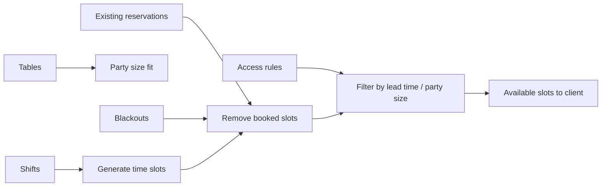

# Booking engine

How Tablevera computes availability and creates conflict-free reservations.

## Availability pipeline

Service entry points:

- `apps/api/src/services/availability.ts` — slot generation
- `apps/api/src/services/smartAssign.ts` — table assignment suggestions

## Creating a reservation

1. Client selects slot + party size
2. Mutation validates restaurant is `approved` and accepting online bookings
3. Optional deposit PaymentIntent created (Stripe)
4. **Slot claim** — atomic insert with unique index on table + time
5. Confirmation notifications enqueued
6. Waitlist entries for overlapping preferences may be notified on later cancellation

## Slot claims (concurrency)

Multiple diners booking the same slot simultaneously:

- First write wins via MongoDB unique index
- Losers receive a GraphQL error suggesting alternate times
- No multi-document transactions required for the standard path

## Table assignment

- **Auto-assign** — `smartAssign` picks smallest fitting table
- **Manual** — staff assigns on floor plan
- **Phone/walk-in** — staff bypasses online slot UI

## Deposits

When a restaurant requires deposits:

1. PaymentIntent created with `capture_method: manual`
2. Reservation stays `pending` until webhook confirms capturable amount
3. On completion or timely cancel, capture or release per policy

Webhook handler: Stripe route in `apps/api/src/routes/`

## Waitlist integration

On cancellation:

1. Worker or synchronous hook finds matching waitlist entries
2. Notifies top-ranked party
3. Party converts via mutation within a time window
4. Unconverted notifications expire to next party

## Reminders & no-shows

BullMQ jobs scheduled at booking time:

- Reminder emails/SMS/push before reservation
- No-show check after grace period → status `no_show`

## Packages & occasions

- **Occasion** enum stored on reservation for restaurant prep
- **Packages** (`RestaurantPackage`) add line items to booking total

## Sources

Track where bookings originate for reporting:

| Source | Origin |
|---|---|
| `network` | Tablevera diner app |
| `website` | Restaurant's own site (non-widget) |
| `widget` | Embedded widget |
| `phone` | Staff-entered phone booking |
| `walkin` | Walk-in entered in dashboard |

## Modification policy

Diners and partners can edit reservations via GraphQL mutations. Restrictions (lead time, deposit forfeiture) enforced in service layer based on restaurant settings.
