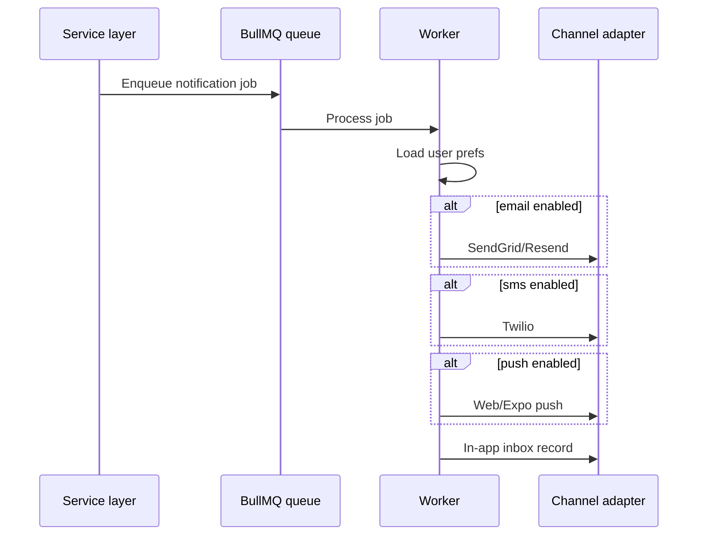

# Notifications

Tablevera delivers operational and marketing messages across multiple channels with per-user preferences.

## Channels

| Channel | Technology | Opt-in |
|---|---|---|
| Email | SendGrid (primary) or Resend | Account email |
| SMS | Twilio | Explicit opt-in at `/sms` |
| Web push | VAPID + service worker | Browser permission |
| Expo push | Expo push tokens | Mobile permission |
| Telegram | Bot webhook | User links chat ID |
| In-app | Notification inbox | Always available |

## Preference model

Each user has `notificationPreferences` with per-event channel toggles:

- `newMessage`
- `newReservation`
- `waitlistAvailable`
- `availabilityAlerts`
- `guestSpendAlert`
- `reservationUpdates`
- `reviewReply`
- `surveyInvitation`
- `loyaltyUpdates`

Each event has `{ sms, email, webPush, platform }` booleans.

## Notification flow



## In-app inbox

Dashboard and web apps poll/subscribe to `MY_NOTIFICATIONS`. Users can mark read individually or bulk.

GraphQL in dashboard: `apps/dashboard/src/lib/graphql.ts` (`MY_NOTIFICATIONS`, mark-read mutations).

## Email branding

Partners customize templates per restaurant (colors, logo, footer). Platform defaults managed in admin **Templates**.

## Transactional vs marketing

- **Transactional** — reservation confirm, reminder, password reset (always attempt if channel enabled)
- **Marketing** — campaigns (`apps/api/src/services/campaigns.ts`) respect opt-out and regulatory requirements

## SMS compliance

Public `/sms` page documents opt-in for transactional SMS. Twilio Verify handles OTP separately from marketing SMS.

See also `docs/twilio-sms-use-cases.md` in the repo.

## Push setup (web)

Requires VAPID keys:

```bash
VAPID_PUBLIC_KEY=
VAPID_PRIVATE_KEY=
VAPID_SUBJECT=mailto:admin@tablevera.online
```

Service worker registered on diner web for subscription management.

## Telegram

When `TELEGRAM_BOT_TOKEN` is set:

1. User links account via bot `/start` flow
2. `telegramChatId` stored on User
3. API registers webhook at `{API_PUBLIC_URL}/webhooks/telegram`

## Failure handling

Failed sends log via structured logger. Jobs retry per BullMQ defaults. Non-critical channels failing do not block the primary operation (e.g. booking still confirms if email fails).
