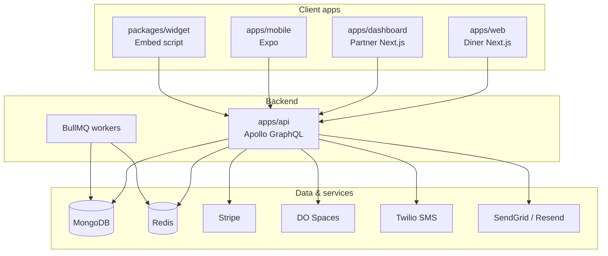

# Architecture overview

Tablevera is a **monolithic GraphQL API** backed by **MongoDB** and **Redis**, with three client applications sharing types through `@reservations/shared`.

## Design principles

1. **GraphQL-first** — all product mutations and queries go through one schema; REST only for webhooks and uploads.
2. **Shared types** — `@reservations/shared` is the contract between API and clients.
3. **Service layer** — resolvers are thin; business logic lives in `apps/api/src/services/`.
4. **Atomic booking** — table slot claims use unique indexes, not distributed locks.
5. **Graceful degradation** — Stripe, Twilio, Spaces, and email stub when env vars are missing.

## Request lifecycle

1. Client sends GraphQL operation with HttpOnly cookies (web/dashboard) or bearer token (mobile).
2. Apollo context loads user from JWT access token.
3. Resolver checks role/ownership via shared helpers and service-level guards.
4. Service reads/writes Mongoose models, enqueues BullMQ jobs, or calls external APIs.
5. Response returns typed payload; subscriptions use WebSocket when enabled.

## Key subsystems

| Subsystem | Docs |
|---|---|
| Monorepo layout | [Monorepo layout](/architecture/monorepo-layout) |
| Data model | [Data model](/architecture/data-model) |
| Auth & roles | [Auth & roles](/architecture/auth-and-roles) |
| Booking engine | [Booking engine](/architecture/booking-engine) |
| Notifications | [Notifications](/architecture/notifications) |
| Integrations | [Integrations](/architecture/integrations) |

## Deployment topology

Production typically runs three Node processes (api, web, dashboard) plus managed MongoDB, Redis, and Spaces. See [Deployment](/developers/deployment).

## Versioning

App version is read from `CHANGELOG.md` at the repo root. Current monorepo version is in root `package.json`.
